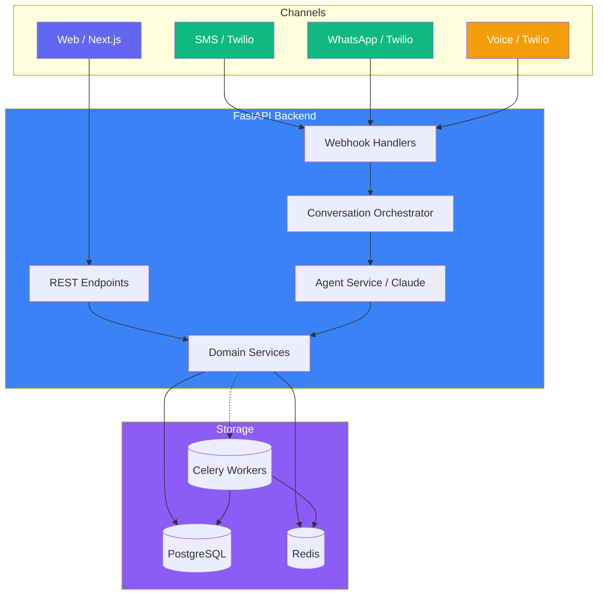

[](https://autonomous-dental-appointment-bot.vercel.app/) [](https://render.com) [](LICENSE)

## Live Preview

[](https://autonomous-dental-appointment-bot.vercel.app/)


# Autonomous Dental Appointment Bot

Production monorepo for a dental clinic appointment automation platform.
Patients book, reschedule, and cancel appointments via SMS, WhatsApp, voice,
or web — powered by an AI agent (Anthropic Claude) with real-time slot locking,
Stripe deposit payments, and Google Calendar sync.

## Architecture



## Repository layout

| Path | Purpose |
|---|---|
| `apps/api/` | FastAPI backend, SQLAlchemy async ORM, Alembic migrations, Celery workers |
| `apps/web/` | Next.js 14 frontend (App Router, TypeScript, Tailwind, shadcn/ui) |
| `apps/worker/` | Additional worker stubs |
| `scripts/` | Seed data, evaluation |

## Google Calendar setup

The app can sync appointments to Google Calendar. Before enabling this feature,
run the one-time OAuth setup script to obtain a refresh token:

```bash
python scripts/setup_google_calendar.py --client-id <ID> --client-secret <SECRET>
```

The script prints a `GOOGLE_CALENDAR_REFRESH_TOKEN` — add it to your environment.
See [DEPLOYMENT.md](DEPLOYMENT.md) for the full list of Google Calendar variables.

## Quick start

```bash
cp .env.example .env           # edit with your keys
docker compose up --build       # starts Postgres, Redis, API, web, workers
```

- API: http://localhost:8000
- Docs: http://localhost:8000/docs
- Web:  http://localhost:3000
- Flower (Celery monitor): http://localhost:5555/flower

## Running tests

```bash
cd apps/api
pip install -r requirements-dev.txt
pytest                           # runs all tests with coverage
pytest --cov --cov-report=html   # detailed HTML coverage report
pytest -m "not slow"             # skip slow/integration tests
```

Coverage threshold is **80%** (enforced by `pytest.ini`). Tests use an
in-memory SQLite database — no Postgres needed for local test runs.

## Migrations

```bash
cd apps/api
alembic revision --autogenerate -m "description"
alembic upgrade head
```

A CI job in `.github/workflows/backend-ci.yml` runs `alembic upgrade head`
against a throwaway Postgres on every PR, so a broken migration never reaches
main.

## Deployment

- **Backend**: Render (see [DEPLOYMENT.md](DEPLOYMENT.md) for the full checklist)
- **Front-end**: Vercel (`.github/workflows/vercel.yml`)
- **CI**: `.github/workflows/backend-ci.yml` (ruff, mypy, pytest, docker build,
  migration check)

## Troubleshooting

### Webhook signature failures

If Twilio webhooks start returning 403 or Stripe events stop processing:

1. **Twilio** — verify `TWILIO_AUTH_TOKEN` matches the token in Twilio Console.
   Rotating the auth token without updating the env var is the most common cause.
2. **Stripe** — verify `STRIPE_WEBHOOK_SECRET` matches the signing secret in
   Stripe Dashboard → Webhooks. If the webhook endpoint was re-created, the
   secret has changed.
3. Both validators reject requests where the body or URL differs from what the
   provider signed — DNS rebinding, HTTP → HTTPS redirect, or trailing-slash
   changes can break validation.

### Agent escalation loop

If the AI agent hands off every conversation to a human despite normal input:

1. **Anthropic API key** — check `ANTHROPIC_API_KEY` hasn't expired or hit a
   rate limit. The agent gracefully degrades to `HUMAN_TAKEOVER` when Claude
   returns an error.
2. **Prompt drift** — an unintentional system prompt change can make the agent
   over-eager to escalate. Revert the last prompt change and re-test.
3. **Context window** — if a conversation has many turns, the agent's context
   may be truncated, causing it to lose the booking objective. See
   `ARCHITECTURE.md` for compaction details.

### Stripe event replay / duplicate processing

Stripe may deliver the same event more than once (at-least-once delivery).
Redis deduplication via `stripe:processed_events:{event_id}` (24-hour TTL)
prevents double-booking. If you see duplicate bookings:

1. Check Redis is running — without it, dedup is skipped.
2. Verify `stripe:processed_events:*` keys exist in Redis.
3. The idempotency window is 24 hours; events older than that are
   re-processed. This is safe because `payment_intent.succeeded` checks
   `deposit_paid` before acting.

## Observability

- **Logging**: Structured JSON by default. Set `LOG_FORMAT=plain` for
  human-readable output. Every log line carries `request_id` or `task_id`.
- **Metrics**: Prometheus endpoint at `/metrics` when `PROMETHEUS_ENABLED=true`.
- **Sentry**: Error tracking for FastAPI and Celery when `SENTRY_DSN` is set.
- **Health**: `/health/live` (process up), `/health/ready` (DB + Redis reachable).
- **Flower**: Celery monitoring at `/flower` (basic-auth protected).

## Related documents

| Document | Contents |
|---|---|
| [ARCHITECTURE.md](ARCHITECTURE.md) | Redis dual role, context compaction, token lifecycle |
| [RUNBOOK.md](RUNBOOK.md) | Operational procedures for incidents |
| [CONTRIBUTING.md](CONTRIBUTING.md) | Coding conventions, PR workflow |
| [DEPLOYMENT.md](DEPLOYMENT.md) | Render deploy checklist, secrets, backup |
